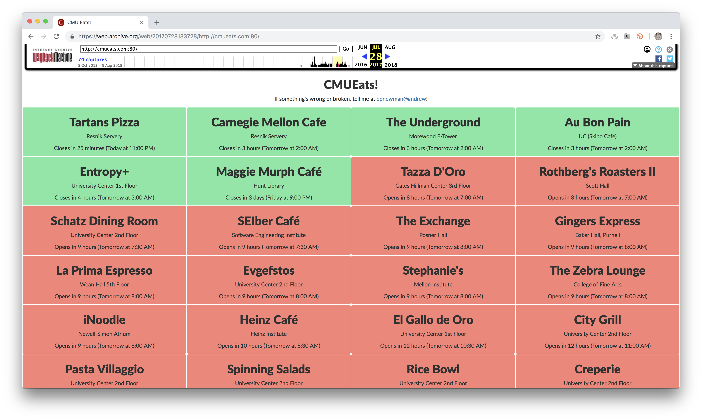
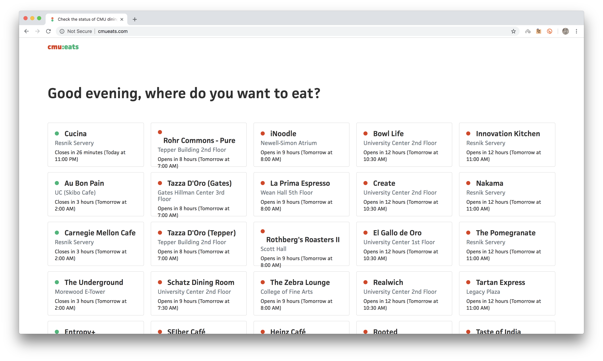

# Better cmueats

_cmueats_ is a web app used by Carnegie Mellon students to check the statuses of eateries on campus. Recently, the site went through an overhaul. Although the site received a nice new modern look, I had negative feelings about it from a UX perspective. I turned my ideas into a day project and created my own version of the site.

_Better cmueats_ (linked [here](https://liao-frank.github.io/better-cmu-eats/)) focuses on a mobile layout and seeks to improve on some of the feedback laid out in the [Design feedback](#design-feedback) section.

## Old vs. new
The original cmueats

The overhauled cmueats

## Design feedback
- Status indication became harder to scan. The full color cards were much easier to scan than a small dot indicator.
- Left-right scan was changed to up-down scan. The new site changed the orientation of how cards were ordered. Westerners scan left to right so it only makes sense to present cards in that orientation.
- Visual bugs such as text overflowing out of the cards.
- No usability features such as search or pinning cards.

## Credits
Thanks Emily and Eric for building and maintaining _cmueats_. It's really a wonderful service and I'm grateful for the work they have done.

Thanks Kevin, Mimi, and Stephanie for testing _better cmueats_.

Thanks Facebook for making `react` and `create-react-app`, I guess.

Made with ❤️ and anxiety at the same time.
